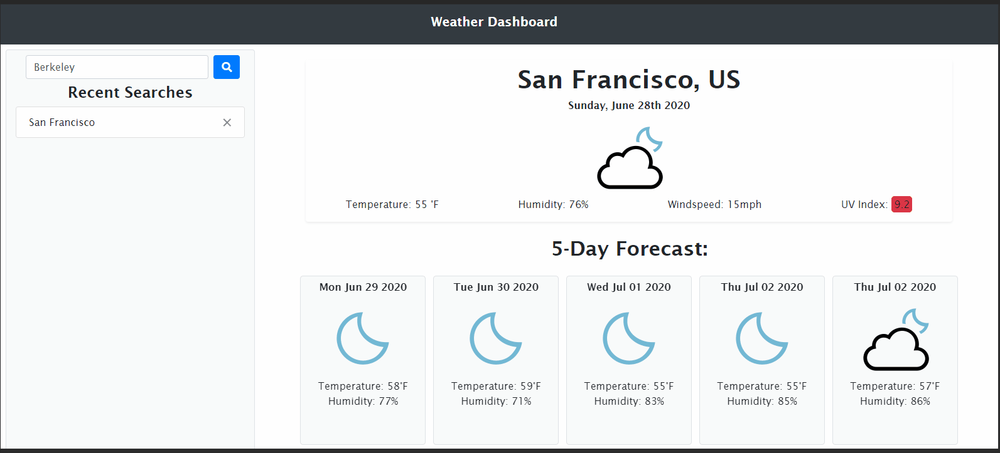

# Weather App

## Objective

To build a responsice weather app that displays the weather of the user's chosen city using three of [openweathermap](openweathermap.org) APIs. This app displays the main weather information such as temperature, humidity, windspeed, and UV index. This app also includes a five day weather forcast. 

## Users' Need
```
AS A traveler
I WANT to see the weather outlook for multiple cities
SO THAT I can plan a trip accordingly
```

## Features
* 🏁 Input search bar to city for user's city.
* 🏁 Searched cities are saved onto localStorage and will display on the left column.
+ 🏁 previously searched cities can be clicked on to quickly display weather conditions.
* 🏁 Information about temperature, humidity, windspeed, and UV index is given.
- 🏁 UV index is highlighted based on severity of sun exposure.
- 🏁 Weather icons are displayed to indicate weather conditions.
- 🏁 Five day weather forecast is displayed for selected city. <br/>
<b>Bonus</b>
- 🚀 Recent searched cities can be deleted by clicking on a close button.
- 🚀 Additional information about weather forecast can be found by hovering over card tiles. 
- 🚀 The last city searched will be reloaded when then page is revisited.

### Technologies and Libraries used:

HTML, CSS, Bootstrap, JS, JQuery, moment.js, OWM API.

## Preview

Link to the site is [here](https://eddyangang.github.io/weather-station/).



## Acknowledgements
The custom weather icons originated from [Peter Schmafeldt](https://github.com/manifestinteractive), link to his icons can be found [here](https://github.com/manifestinteractive/weather-underground-icons).